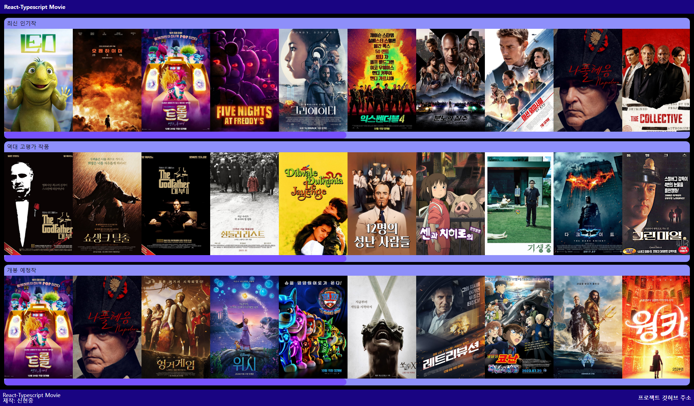
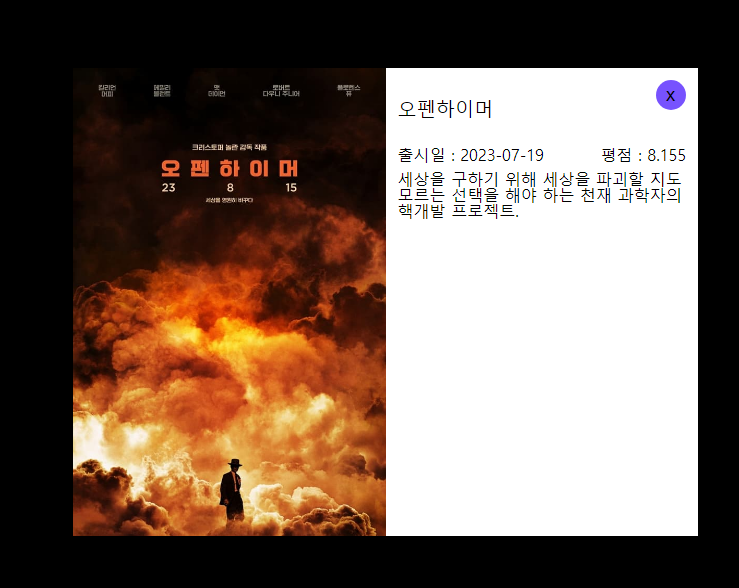
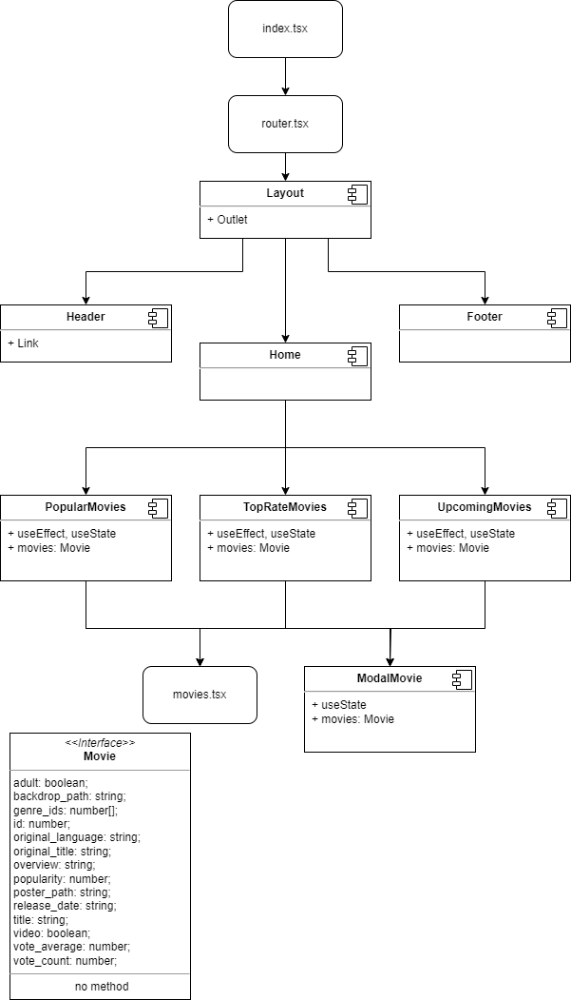

# TypeScript를 적용한 React 영화사이트

TMDB 사이트의 영화 데이터를 Axios로 받고 작업했습니다.

## ⏰ 개발기간
일시 : 2023.10.17(화) ~ 2023.10.29(일)

## 🛠 Tech Stack & 개발환경

Node.js: 18.17.0

## 💠컴포넌트 구조

## 🔥이슈 관리
### 모달 출력시, 마우스가 브라우저를 벗어나면 사라짐
1. 영화 카드 호버시에 간략한 영화 정보 및 자세히 보기 버튼이 출력됨 
2. 모달은 자세히 보기 버튼을 누르면 영화 상세 정보 모달 컴포넌트가 출력됨
3. 모달 컴포넌트는 영화 카드 호버시에만 보여서 문제 발생
  
- 문제해결
1. 모달 컴포넌트를 호버 효과가 적용된 tag 밖으로 이동하고, 버튼만 호버시에 출력
2. 모달 useState를 모달 컴포넌트가 아닌 부모 컴포넌트에서 관리

### 영화리스트 컴포넌트 리펙토링
1. 기존에는 [최신 인기작, 역대 고평가 작품, 개봉 예정작] 영화리스트 컴포넌트가 별개로 존재했음
2. 재사용성과 유지보수를 위해 컴포넌트 통합 -> MovieList
- api도 getMovies 함수 생성 (src/api/movies.tsx)
- MovieList 컴포넌트는 props로 movieListType과 title을 상속받음

## 🍀 배운점 및 느낀점
### 타입스크립트 첫 사용 경험
타입을 지정하여 안전성을 높일 수 있지만, 원시형 타입이 아닌 경우 타입 처리에 공부가 필요했습니다.
interface를 사용하여 타입의 정의하여 사용했습니다.

사용하면서 타입스크립트를 많이 배울 수 있었습니다.
